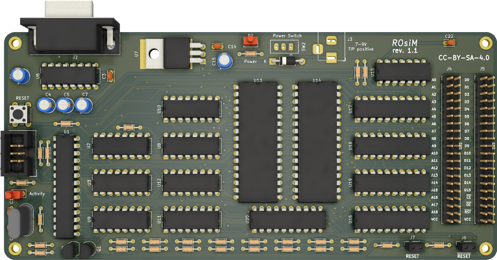

# ROsiM - ROM simulator

## Introduction

The ROsiM is a ROM simulation / emulation board: it uses 2x 512k/8 bit SRAM chips to simulate 8 or 16 bit ROMs up to 512k bytes or 512k words in size.

The data is uploaded via RS232 connection that is used to control the board.

## Board

### Connections

**TODO**

## Software

### Protocol

**TODO**
