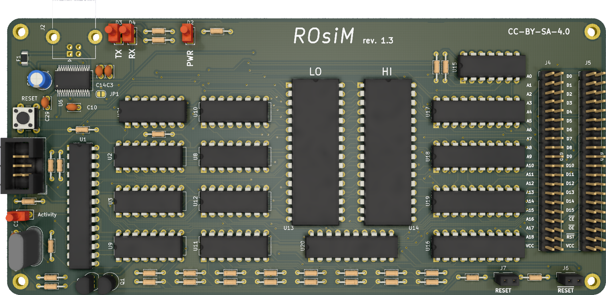

# ROsiM - ROM simulator

## Introduction

The ROsiM is a ROM simulation / emulation board: it uses two 512k/8bit SRAM chips to simulate an 8 or 16 bit ROM (up to 512k bytes or 512k words in size).

The board is based around an ATMega328P chip @20Mhz, controlled via RS232 connection.

I made this out of my personal need of a simple way to quickly test ROM images on boards I repair/hack/build. Often, these boards use big 16bit EPROMs and the projects I found around did not cater to my needs.

The idea is to use this bare board and then "pods" that attach to the two 40pin header and adapt it to simulate various types of ROMs.

**WARNING:** While I might help you with quick questions, there is NOT going to be hand-holding for this one.

### Caveat Emptor!

I have currently built and tested revision 1.0 of this board, revision 1.1 onward are work in progress and as of yet untested and unbuilt. I will update this notice once a new design gets tested.

## Board

This board is designed around relatively cheap through hole (with a few exceptions) components, and should be buildable by anyone with basic soldering skills.

You'll need a way to program your 328P MCU with the bootloader (you can then load the firmware via serial port).

I recommend [optiboot](https://github.com/Optiboot/optiboot). Remember to set the AVR frequency to 20Mhz and baudrate to 115200bps. I might provide prebuilt binaries of this in the future.

### Bill of Materials

**TODO**

### Connections

#### J1 - ISP 6 pin header

This is used for in-circuit programming of the MCU. You won't really use after burning the bootloader to the chip. You can leave this out if you pre-program the ATMega.

#### J2 - DB9 female - RS232 Serial port

Connect your RS232 cable here, you don't need to invert TX/RX, so a straight-through cable will work.

The Interface runs at 115200bps 8-n-1. The protocol is mainly ASCII based, but meant to be used with an external software.

#### J3 - Barrel jack for power

Connect your DC power supply here, **center tip positive**.
Anything between 7 to 9V will be good, 12V will work, but the regulator might get hotter. 500mA should be enough.

#### J4 - Address header

A 40 pin header:

- Odd pins 1 thru 37 on the left side will bring out the address lines (A0-A18).
- Pin 39 will be this board's VCC.
- All even pins on the right are GND.

#### J5 - Data header

A 40 pin header: 

- Odd pins 1 thru 31 on the left side will bring out the data lines (D0-D15).
- Pin 33 will be the /CE signal input.
- Pin 35 will be the /OE signal input.
- Pin 39 will be this board's VCC.
- All even pins on the right are GND.

#### J6 - /RESET header

An active-low OC signal will be present on this header. You can use to pilot the /RESET of your target board.

Solder an arc of rigid wire on this one, so you can attach a small crocodile clip to it.

#### J7 - RESET header

An active-high signal (either high or disconnected) will be present on this header.

Solder an arc of rigid wire on this one, so you can attach a small crocodile clip to it.
## Software

While this board can be controlled directly via a simple serial terminal, it is advised to use a client software that supports the following protocol, like the [ROsiM Loader](https://github.com/hkzlab/ROsiM_Loader).

### Protocol

The **Remote Control** protocol is pretty simple and ASCII based. It supports 12 commands, each with its own syntax and response.

String `CMD_ERR` will be sent in case the command is not recognized, string `CMD_INV` will be sent in case the command cannot be executed at this time.

#### RESET

- Syntax: `>K<`
- Response: none

Forces the reset by watchdog of the ROsiM.

#### MODEL

- Syntax: `>M<`
- Response: `[M xx]`

Returns the current model of the board in hex. 

#### ADDRESS

- Syntax: `>A 00xxxxxx<`
- Response: `[A 00xxxxxx]`

Specifies the start address for the next read/write commands.
The address must be specified in hex, and a mask of 0x7FFFF will be applied to it.

#### WRITE

- Syntax: `>W xxxx<`
- Response: `[W xxxx]`

The SRAM must be in WRITE mode and the board switched to INTERNAL, otherwise the response `CMD_INV` will be sent.

`xxxx` is the data to write on SRAM at the current address in hex format.
Once the write completes, the **address will automatically increment by 1**.

#### READ

- Syntax: `>R<`
- Response: `[R xxxx]`

The SRAM must be in READ mode and the board switched to INTERNAL, otherwise the response `CMD_INV` will be sent.

`xxxx` is the data written at the current address in hex format. Once the read completes, the **address will automatically increment by 1**.

#### EXTERNAL RESET

- Syntax: `>E y<` where `y` can be `0` or `1`
- Response: `[E y]`

Enables (`1`) or disables (`0`) the external RESET signal to the target board.

#### INTERNAL/EXTERNAL SWITCH

- Syntax: `>S y<` where `y` can be `0` or `1`
- Response: `[S y]`

To execute this command, the SRAM must be in READ mode, otherwise the response `CMD_INV` will be sent.
Sets the board to INTERNAL (`1`) or EXTERNAL (`0`) mode. EXTERNAL mode will enable the drivers that communicate through the external address/data/control lines.

#### READ/WRITE SWITCH

- Syntax: `>X y<` where `y` can be `0` or `1`
- Response: `[X y]`

To execute this command, the board must be in INTERNAL mode, otherwise the response `CMD_INV` will be sent.
Sets the SRAM to READ (`1`) or WRITE (`0`) mode.

#### VIEW

- Syntax: `>V<`
- Response: `[V 00xxxxxx yy]`

This command will print out the current address in hex format (`00xxxxxx`) and a mask (`yy`) in hex format that contains:

- bit 0: INTERNAL/EXTERNAL state
- bit 1: READ/WRITE state
- bit 2: EXTERNAL RESET state

#### DEFAULTS

- Syntax: `>D<`
- Response: `[D]`

Will revert the board state to the following state:

- INTERNAL
- SRAM in READ mode
- EXTERNAL RESET disabled

The selection of the EXTERNAL RESET logic will **NOT** be restored by this command and will remain set to the current state.

#### TEST

- Syntax: `>T<`
- Response: `[T xx]`

Resets the board to defaults then executes a test on the SRAMs by writing patterns of data in them and reading them back.

The output can be:

- `00` test was completed successfully
- `01` test failed while writing the first pattern (`0xAA55`)
- `02` test failed while writing the first pattern (`0x55AA`)
- `03` the test failed while writing the incremental pattern

#### XMODEM

- Syntax: `>O x<`
- Response: `[O yy]`

Starts an XMODEM transfer of a binary file into the SRAM.

`x` can be:

- `0` The file will be considered an 8-bit dump, the highest 8 bits of the SRAM will be set to `0x00`, only the lower 8 bits will be set.
- `1` The file will be considered a 16-bit dump, and the data will be loaded into the SRAM in words. ODD bytes in the dump will end up in the high byte of the SRAM, EVEN bytes will end up in the low byte of the SRAM.
- `2` The file will be considered a **byte swapped** 16-bit dump, and the data will be loaded into the SRAM in words. EVEN bytes in the dump will end up in the high byte of the SRAM, ODD bytes will end up in the low byte of the SRAM.

`yy` will be:

- `00` for a failed transfer.
- `01` for a successful transfer.
